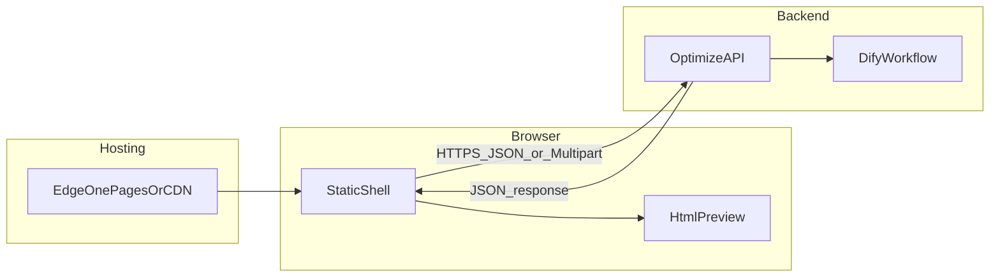

# 轻量静态页前端架构设计

本文描述「HTML/CSS + 少量原生 JavaScript」形态下的前端分层、与后端的边界、EdgeOne Pages 静态托管约定，以及 AI 生成 HTML 的安全预览策略。产品目标与 Dify 工作流定义见 [design.md](./design.md)。

---

## 1. 目标与非目标

### 1.1 目标

- **零构建或极简构建**：页面以静态资源为主，可直接部署到 EdgeOne Pages（或任意静态托管）。
- **双通道输入**：简历与 JD 均支持「文件上传」与「纯文本粘贴」，与产品设计一致。
- **统一后端契约**：前端只调用自有后端暴露的 HTTP API；由后端代理或编排 Dify Workflow，**不在浏览器中存放 Dify API Key**。
- **安全展示模型输出的 HTML**：在隔离环境中预览简历 HTML，并配合服务端消毒与浏览器沙箱做纵深防御。
- **基础体验**：提交中禁用重复提交、加载态、可读的错误提示；避免将完整简历/JD 写入控制台日志（隐私）。

### 1.2 非目标

- 不引入 React/Vue 等大型 SPA 框架（除非后续另有决策）。
- 不在前端实现复杂路由与全局状态机；页面以单屏为主。
- 不在本文重复 Dify 节点提示词或 EdgeOne Token 申请步骤（见 design.md）。

---

## 2. 总体架构

浏览器加载托管在 EdgeOne（或同源反向代理后的静态目录）上的 **`index.html` + CSS + ES Module JS**。用户填写表单后，前端通过 **`fetch`** 将数据发往后端；后端调用 Dify 等工作流并返回结构化 JSON；前端将文本与建议用于展示，将 HTML 放入隔离预览区。

本仓库已在 **`cloud-functions/api/optimize.js`** 实现与 [第八节](#8-api-契约草稿假设) 对齐的 **`POST /api/optimize`**（EdgeOne **Cloud Functions**，可与静态资源同属一个 Pages 项目）。工作流耗时长、请求体较大时不宜使用 Edge Functions（平台限制更严），详见 [CONFIGURATION.md](../CONFIGURATION.md)。




**边界说明**


| 层级   | 职责                                   |
| ---- | ------------------------------------ |
| 静态页  | 采集输入、校验交互、调用自有 API、渲染结果与安全预览         |
| 后端   | 鉴权（若需要）、校验、调用 Dify、HTML 消毒（推荐）、统一错误码 |
| Dify | 工作流执行；密钥仅在后端配置                       |


---

## 3. 页面信息架构

建议单页划分为以下区块（具体样式不限）。

1. **输入区**
  - 简历：文件选择（Word/PDF，与后端/Dify 限制对齐）、多行文本「或直接粘贴简历」。
  - JD：同上。
  - **前端 UX 提示**：至少提供一种简历来源与一种 JD 来源（文件或文本二选一或组合）；文案可与 design.md 一致。**最终以服务端校验为准**，前端可做相同规则以减少无效请求。
2. **操作区**
  - 「开始优化」提交按钮；进行中禁用并显示加载态。
  - 「清空」可选：重置表单与结果区。
3. **结果区**（可用 Tab、折叠面板或纵向分段）
  - **优化后纯文本简历**：`<pre>` 或可复制文本块。
  - **HTML 简历预览**：见第 5 节。
  - **个性化建议**：Markdown 可由后端渲染为安全 HTML 片段后下发，或返回纯文本分段展示。
4. **页脚说明**
  - 支持的文件格式、大小上限（与后端一致）。
  - 简要隐私说明（数据发往服务器与 AI 服务处理）。

---

## 4. 前端分层（逻辑模块）

采用原生 ES Module 按职责拆分文件（示例路径，实现时可微调）。


| 模块           | 路径示例                    | 职责                                                           |
| ------------ | ----------------------- | ------------------------------------------------------------ |
| `config`     | `js/config.js`          | `API_BASE`、请求超时、可选的运行时环境变量读取                                 |
| `api/client` | `js/api/client.js`      | 基于 `fetch` 的封装、`FormData` 构造、`AbortController`、统一解析 JSON 与错误 |
| `ui/forms`   | `js/ui/forms.js`        | 绑定表单控件、文件列表、提交前的前端友好校验                                       |
| `ui/preview` | `js/ui/preview.js`      | 将后端返回的 HTML 写入 sandboxed iframe 或 Shadow DOM                 |
| `ui/state`   | `js/ui/state.js` 或内联于入口 | 极简对象持有「空闲 / 加载 / 成功 / 错误」与当前结果引用；可用自定义事件在各模块间通信，避免引入状态库      |


**入口**：`js/main.js` 负责组装上述模块并在 `DOMContentLoaded` 后初始化。

---

## 5. HTML 预览：`iframe srcdoc` 与 Shadow DOM

### 5.1 对比


| 方案                      | 适用场景                                                            | 说明                                |
| ----------------------- | --------------------------------------------------------------- | --------------------------------- |
| `**iframe` + `srcdoc`** | AI 返回**完整 HTML 文档**（含 `<!DOCTYPE>`、`<html>`、`<head>`、`<style>`） | 与主页面样式天然隔离；配合 `sandbox` 限制脚本与顶层导航 |
| **Shadow DOM**          | 后端保证返回的是**可控片段**（无完整文档外壳）                                       | 样式隔离好；嵌入完整文档需额外解析/剥离，复杂度高         |


### 5.2 推荐默认

- 工作流产出为「完整 HTML 文件」时：优先使用 `**iframe` + `srcdoc`**。
- `sandbox` 建议：**默认不包含 `allow-scripts`**，使预览区以静态渲染为主，显著降低 XSS 影响面。若业务强制需要页内交互（一般简历预览不需要），须另行评估并接受风险。

### 5.3 Shadow DOM 何时采用

当后端统一将简历渲染为**消毒后的片段**（仅允许少量标签与 class），且希望与主应用 DOM 同一文档管理时，可用 Shadow DOM 挂载该片段，减少 iframe 布局嵌套问题。

---

## 6. 内容与 XSS（纵深防御）

1. **不信任模型输出**：AI 生成的 HTML 可能包含恶意脚本或钓鱼链接；不能仅凭「来源是自家工作流」而省略防护。
2. **服务端（推荐）**：在后端对 HTML 做 **allowlist 消毒**（标签、属性、URL scheme），或仅返回服务端渲染的安全子集。
3. **客户端**：使用 **sandboxed iframe**（禁用脚本）作为第二层防护；避免对返回的 HTML 使用 `innerHTML` 直接写入主文档。
4. **CSP**：部署时为静态页配置合理的 `Content-Security-Policy`，可限制脚本来源与 `frame-src`/`sandbox` 组合策略（具体值与 EdgeOne 能力以实际平台为准）。

---

## 7. 配置、环境与密钥

### 7.1 前端（EdgeOne 静态资源，不得存放密钥）

浏览器里只能出现**非敏感**配置，例如：


| 名称         | 用途                                                                                         | 存放位置                                            |
| ---------- | ------------------------------------------------------------------------------------------ | ----------------------------------------------- |
| `API_BASE` | 你的「优化接口」根地址（如 `https://your-domain.com` 或 `https://xxx.edgeone.app`，且与 `/api` 同源或已配置 CORS） | `js/config.js`、构建占位符或 `window.__ENV__.API_BASE` |


**构建期占位符**：部署流水线将 `%%API_BASE%%` 替换为真实 origin；静态仓库内不写生产 URL 亦可。

**运行时注入**：在 `index.html` 根部用可信脚本设置 `window.__ENV__ = { API_BASE: 'https://…' }`；`config` 读取。**不要**在此注入任何 Dify Key、EdgeOne 部署 Token。

### 7.2 后端或边缘函数（调用 Dify 的运行环境）

凡能执行「接收表单 → 调 Dify Workflow API」的进程（云函数、容器、边缘函数等），用**平台提供的环境变量**存放下列密钥，且仅限该运行时读取：


| 名称                          | 从哪里获取                                                                                        | 用途                                           |
| --------------------------- | -------------------------------------------------------------------------------------------- | -------------------------------------------- |
| `DIFY_API_KEY`（或平台内等价命名）    | Dify：**Settings → API Access** 创建 **Dataset / App / Workflow 可用的 API Key**（以你实际调用的 API 类型为准） | `Authorization: Bearer <key>` 调用 Dify 开放 API |
| `DIFY_API_URL`（可选但强烈建议显式配置） | Dify 云端为固定域名；**自建 Dify** 为你的实例根 URL（如 `https://dify.example.com`）                            | 拼接 `/v1/...` 等工作流、上传文件等接口路径                  |
| Workflow / App 标识           | Dify 控制台对应 Workflow 或应用的 **API 文档 / 运行接口**中给出的 ID                                            | 请求体里指定要运行的工作流                                |


说明：

- **不要把 `DIFY_API_KEY` 写进前端 JS、EdgeOne 静态文件或公开仓库。**
- 若使用 Dify **文件上传**接口，仍使用同一服务端 Key；上传成功后的 `id` 再作为 workflow 输入传给 Dify。
- 自建 Dify 若启用访问控制，还可能涉及实例级反向代理证书等，但**调用 Workflow 的 Bearer Key 仍是上述 API Key**。

### 7.3 可选：`design.md` 中的 EdgeOne API Token（另一套用途）

若采用 **Dify 内置「EdgeOne Pages」插件**把工作流输出**部署**到 EdgeOne（而非浏览器直连 Dify），需要在 **Dify 插件配置**里填写腾讯云 **EdgeOne API Token**（Pages 部署权限）。这与「自建静态页 + 自建后端调 Workflow」**不是同一套密钥**：自建页路径下通常**不需要**把 EdgeOne Token 交给前端；除非你仍在用插件做自动发布静态站点，此时 Token 只应保存在 **Dify 插件凭据**中，见 [design.md](./design.md) 第三节。

### 7.4 若你为自有 `/api` 增加鉴权（可选）

为防止他人盗刷你的优化接口，可为 `POST /api/optimize` 增加服务端校验，例如：


| 名称                                   | 存放位置    | 用途                   |
| ------------------------------------ | ------- | -------------------- |
| `INTERNAL_API_SECRET`、站点密钥或 JWT 签发密钥 | 仅后端环境变量 | 校验调用是否来自你的前端或其它可信调用方 |


此为增量能力，与 Dify Key 相互独立。

---

## 8. API 契约草稿（假设）

以下仅供前后端对齐参考，路径与字段可在实现时调整。

**请求**

- `POST /api/optimize`
- `Content-Type: multipart/form-data`
- 字段示例：
  - `resume_file`（可选，二进制）
  - `resume_str`（可选，字符串）
  - `jd_file`（可选，二进制）
  - `job_desc`（可选，字符串）

**成功响应** `200`，`Content-Type: application/json`

```json
{
  "matchScore": 85,
  "optimizedText": "优化后的纯文本简历……",
  "html": "<!DOCTYPE html><html>…</html>",
  "suggestions": "分段的建议文本或结构化数组",
  "meta": {
    "requestId": "uuid-for-support"
  }
}
```

**错误响应**（示例）


| HTTP 状态       | 含义               | 前端处理建议              |
| ------------- | ---------------- | ------------------- |
| `400`         | 参数缺失或格式错误        | 展示 `message`，对照表单高亮 |
| `413`         | 上传过大             | 提示压缩或改用文本           |
| `422`         | 业务校验失败（如缺简历或 JD） | 与 UX 文案一致           |
| `429`         | 限流               | 提示稍后重试              |
| `502` / `504` | 上游/Dify 超时       | 提示重试，保留表单内容         |


错误体建议统一形如：`{ "error": { "code": "STRING", "message": "人类可读" } }`。

**取消请求**：用户快速切换或重复提交时，使用 `AbortController` 中止上一次 `fetch`。

---

## 9. 静态资源与 EdgeOne 部署约定

**目录建议**

```
/
  index.html
  css/
    main.css
  js/
    main.js
    config.js
    api/
      client.js
    ui/
      forms.js
      preview.js
```

`index.html` 中使用 `<script type="module" src="/js/main.js"></script>`。

**跨域**

- 若 API 与静态页**不同源**：后端需配置 CORS（限定 origin），或在前缘使用**同源反向代理**（静态与 `/api` 同域名），后者往往更简单。
- 凭证 cookie（若未来引入登录）：需 `credentials` 与 CORS 精确配置，本文默认匿名调用可暂不启用。

**缓存**

- `index.html`：短缓存或不缓存，避免引用旧入口。
- `css/`、`js/`：实现阶段可为文件名加内容 hash 并设长期缓存。

---

## 10. 错误与可观测性

- 网络失败、`fetch` 异常：统一映射为用户可见文案，避免暴露堆栈。
- HTTP 非 2xx：解析后端 `error` 对象；若无 JSON，退化为通用错误提示。
- **日志**：不在生产环境 `console.log` 完整简历/JD；如需调试，使用脱敏或本地开关。
- **未来若采用 SSE 流式输出**：在 `api/client` 中单独封装_reader，并在 UI 层增量更新；当前静态壳可先预留扩展点注释。

---

## 11. 后续演进（简述）

若迁移到 SPA 框架，下列约定可直接复用：**后端 JSON 契约**、**HTML 消毒与安全预览策略**、`api/client` 的分层思路。不建议在未测量性能瓶颈前过早引入框架。

---

## 相关文档

- [design.md](./design.md)：产品流程、Dify 工作流与 EdgeOne 部署操作说明。

**Dify API Key**  app-iPqsgiDGLMrcgS0roBLhguDm